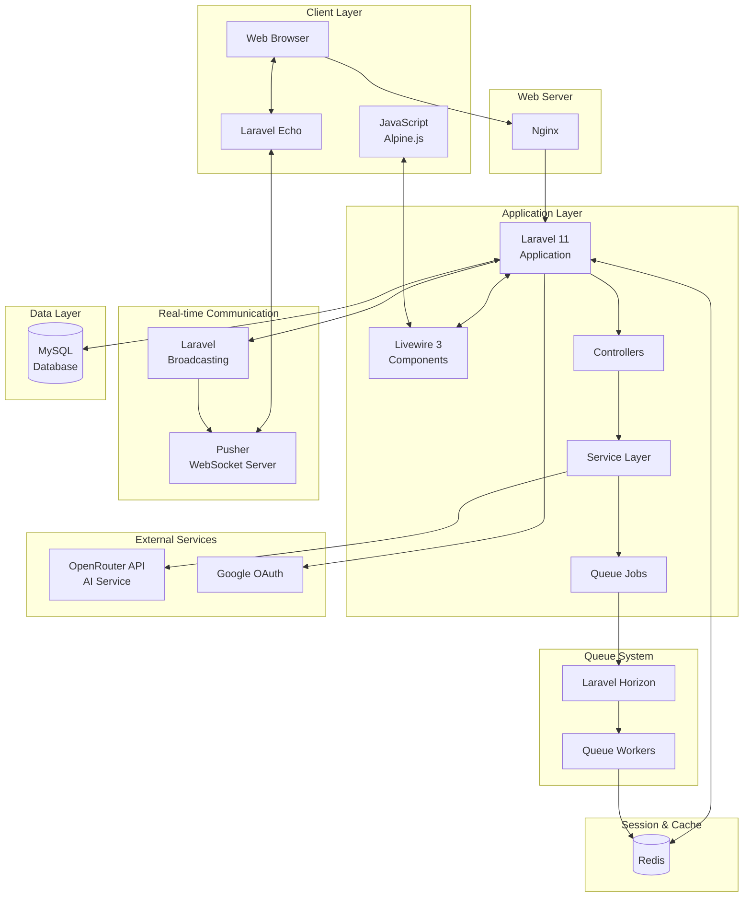

# システム全体アーキテクチャ

## 概要

DebateMatchは、Laravel 11を基盤とした3層アーキテクチャを採用したリアルタイムディベートアプリケーションです。フロントエンドにLivewire 3, Alpine.js, JavaScriptを使用し、WebSocketによるリアルタイム通信とキューベースの非同期処理を実装しています。

## アーキテクチャダイアグラム



## レイヤー詳細

### 1. クライアントレイヤー

- **Webブラウザ**: ユーザーインターフェース
- **Alpine.js**: リアクティブなUIコンポーネント管理
- **Laravel Echo**: WebSocket接続とイベントリスニング
- **Vite**: アセットバンドリングとHMR

### 2. Webサーバー層

- **Nginx**: リバースプロキシとロードバランシング
- 静的ファイルの配信
- SSL/TLS終端

### 3. アプリケーション層

#### 3.1 Laravel Core

- **ルーティング**: web.php
- **ミドルウェア**: 認証、権限、接続状態チェック
- **リクエスト検証**: FormRequestクラス

#### 3.2 Livewire Components

```
- ConnectionStatus: ユーザー接続状態表示
- ContactForm: お問い合わせフォーム
- FlashMessage: フラッシュメッセージ表示
- Debates/
  - Chat: リアルタイムチャット・メッセージ表示
  - EarlyTermination: ディベート早期終了機能
  - Header: ディベート進行状況表示
  - MessageInput: メッセージ入力フォーム
  - Participants: ディベート参加者情報
  - Timeline: ディベート進行タイムライン
- Rooms/
  - Participants: ルーム参加者管理
  - StartDebateButton: ディベート開始制御
  - Status: ルーム状態表示
```

#### 3.3 サービス層

```
- AIService: AI統合のベースサービス
- AIEvaluationService: ディベート評価
- ConnectionLogger: 接続ログ記録
- ConnectionCoordinator: 接続状態調整
- RoomCreationService: ルーム作成ロジック
- RoomParticipationService: 参加者管理
- DebateService: ディベート進行管理
- PusherEventProcessor: Webhookイベント処理
```

### 4. リアルタイム通信層

- **Pusher**: WebSocketサーバー
- **Laravel Broadcasting**: イベントブロードキャスト
- **プライベートチャンネル**: 認証付きチャンネル
- **プレゼンスチャンネル**: 参加者リスト管理

### 5. データ永続化層

- **MySQL**: メインデータベース
    - Users, Rooms, Debates, Messages, Evaluations
- **Redis**: キャッシュとセッション
    - セッション管理
    - キャッシュ
    - キューストレージ

### 6. 非同期処理層

- **Laravel Horizon**: キュー管理ダッシュボード
- **Queue Jobs**:
    - AdvanceDebateTurnJob
    - EvaluateDebateJob
    - GenerateAIResponseJob
    - HandleUserDisconnection
    - EarlyTerminationTimeoutJob

## セキュリティアーキテクチャ

### 認証・認可

- Laravel Breeze (Email/Password認証)
- Laravel Socialite (Google OAuth)
- ゲストユーザー管理（有効期限付き）
- 管理者権限（AdminMiddleware）

### データ保護

- HTTPS通信
- CSRFトークン保護
- XSS対策（Blade自動エスケープ）
- SQL Injection対策（Eloquent ORM）

## 技術的特徴

1. **リアルタイム双方向通信**: Pusher WebSocketsによる低遅延通信
2. **非同期処理**: Laravel Horizonによる堅牢なジョブ処理
3. **リアクティブUI**: Livewire 3による動的なUI更新
4. **AI統合**: OpenRouter APIを使用した柔軟なAI実装
5. **マルチ言語対応**: 日本語・英語の完全サポート
