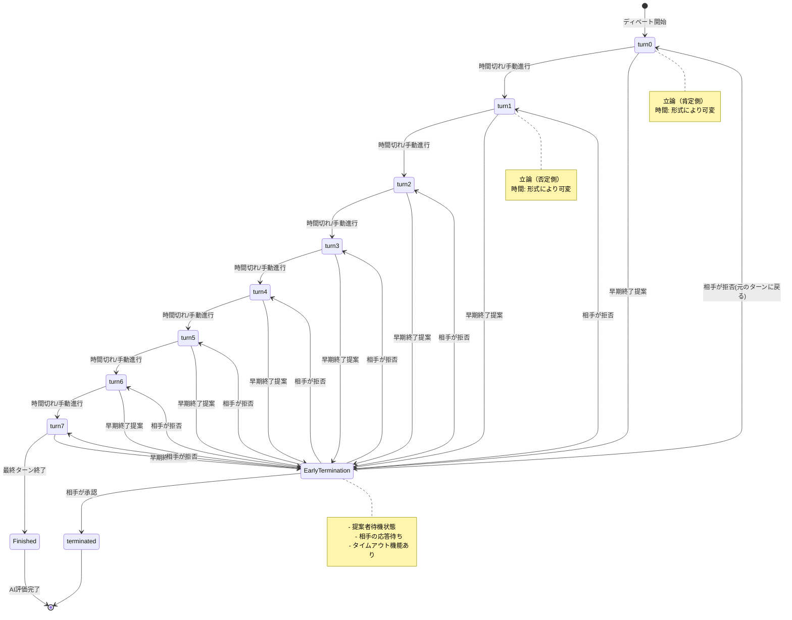

# ディベート状態遷移図

## 概要

DebateMatchでは、ルームとディベートの状態を厳密に管理し、適切な状態遷移のみを許可することで、システムの整合性を保っています。本ドキュメントでは、これらの状態遷移と各状態での可能なアクションを定義します。

## ルーム状態遷移図


## ディベート進行状態遷移図



## 早期終了フロー


## 状態定義

### ルーム状態（Room Status）

| 状態         | 値           | 説明                                             |
| ------------ | ------------ | ------------------------------------------------ |
| 待機中       | `waiting`    | ルームが作成され、参加者を待っている状態         |
| 準備完了     | `ready`      | 両サイドに参加者が揃い、ディベート開始可能な状態 |
| ディベート中 | `debating`   | ディベートが進行中の状態                         |
| 終了         | `finished`   | ディベートが正常に終了した状態                   |
| 削除済み     | `deleted`    | ルームが削除された状態                           |
| 強制終了     | `terminated` | 早期終了や異常により強制終了した状態             |

### ディベートターン

| ターン | 説明               | 話者   | 時間           |
| ------ | ------------------ | ------ | -------------- |
| 0      | 立論（肯定側）     | 肯定側 | 形式により可変 |
| 1      | 立論（否定側）     | 否定側 | 形式により可変 |
| 2      | 準備時間           | なし   | 形式により可変 |
| 3      | 質疑（否定→肯定）  | 両方   | 形式により可変 |
| 4      | 第一反駁（否定側） | 否定側 | 形式により可変 |
| 5      | 第一反駁（肯定側） | 肯定側 | 形式により可変 |
| 6      | 最終弁論（否定側） | 否定側 | 形式により可変 |
| 7      | 最終弁論（肯定側） | 肯定側 | 形式により可変 |

### 早期終了状態

| 状態        | 説明                       |
| ----------- | -------------------------- |
| `none`      | 通常状態                   |
| `requested` | 早期終了が提案された状態   |
| `agreed`    | 早期終了が承認された状態   |
| `rejected`  | 早期終了が拒否された状態   |
| `timeout`   | 提案がタイムアウトした状態 |

## 実装詳細

### 状態遷移の検証

```php
// Room.php の updateStatus メソッド
$validTransitions = [
    self::STATUS_WAITING => [self::STATUS_READY, self::STATUS_DELETED, self::STATUS_TERMINATED],
    self::STATUS_READY => [self::STATUS_DEBATING, self::STATUS_WAITING, self::STATUS_DELETED, self::STATUS_TERMINATED],
    self::STATUS_DEBATING => [self::STATUS_FINISHED, self::STATUS_DELETED, self::STATUS_TERMINATED],
    self::STATUS_FINISHED => [self::STATUS_FINISHED],
    self::STATUS_DELETED => [self::STATUS_DELETED],
    self::STATUS_TERMINATED => [self::STATUS_TERMINATED],
];
```

### ターン進行の管理

1. **自動進行**: `turn_end_time`に基づいてキューシステムが自動的に次のターンへ
2. **手動進行**: 現在の話者が終了ボタンで進行
3. **準備時間**: 発言不可、時間経過または次の話者が終了ボタンで進行
4. **質疑応答**: 両者が発言可能、時間制限あり
