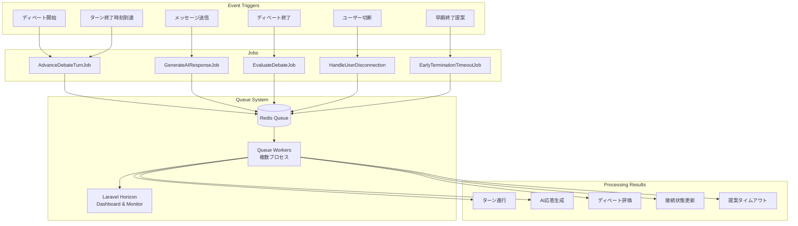
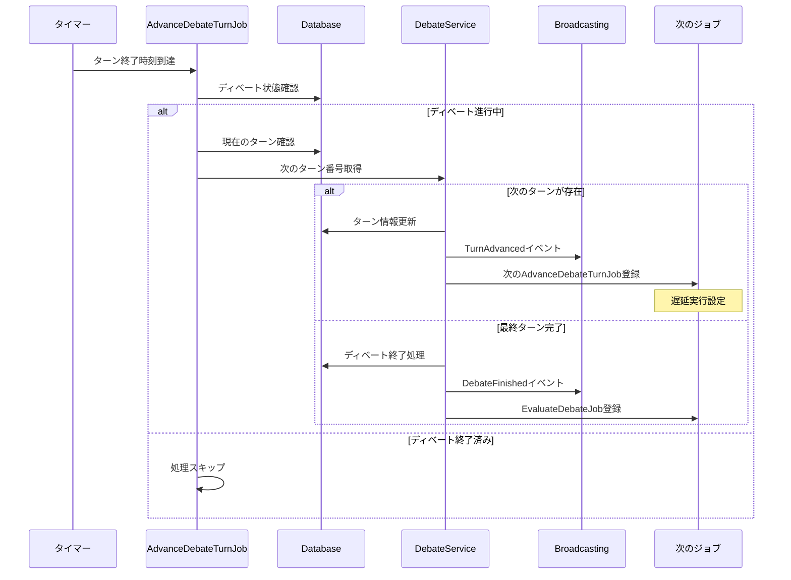
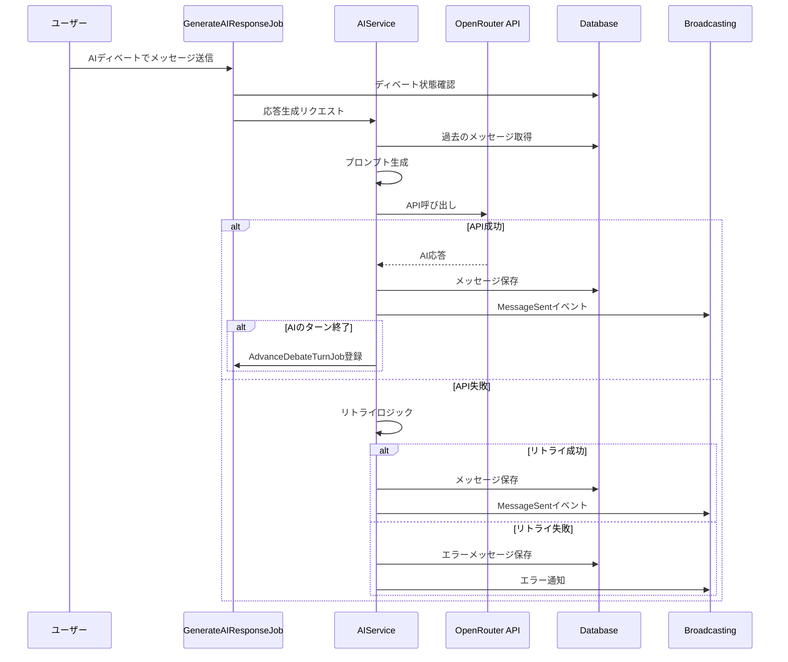
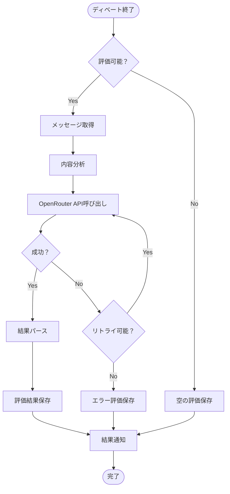
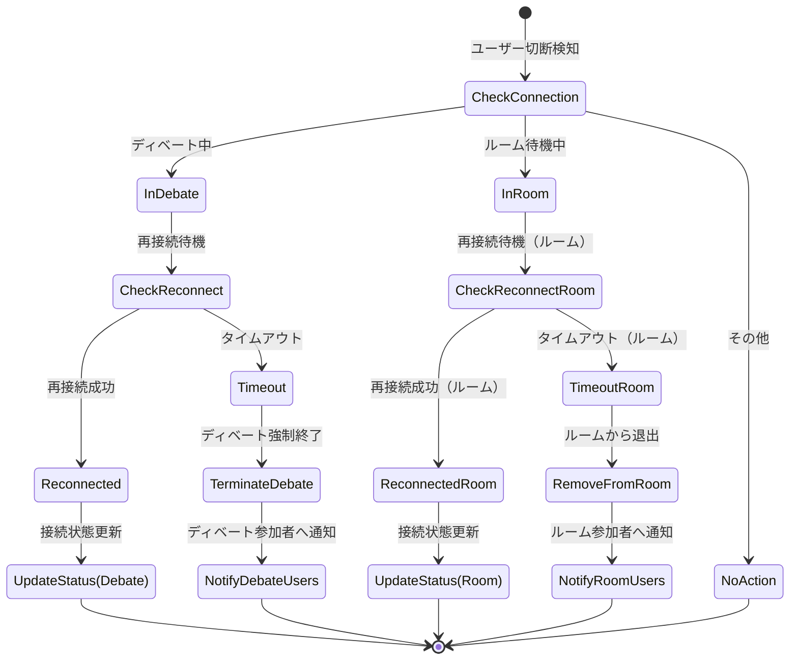
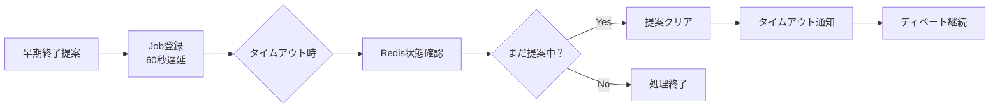

# キューシステム・ジョブフロー図

## 概要

DebateMatchは、Laravel Horizonを使用した堅牢な非同期処理システムを実装しています。リアルタイムディベートの進行管理、AI応答生成、評価処理など、時間のかかる処理やタイミングクリティカルな処理をキューシステムで管理しています。

## キューシステム全体構成

## 主要ジョブの詳細フロー

### 1. AdvanceDebateTurnJob - ターン進行ジョブ

### 2. GenerateAIResponseJob - AI応答生成ジョブ

### 3. EvaluateDebateJob - ディベート評価ジョブ

### 4. HandleUserDisconnection - ユーザー切断処理ジョブ

### 5. EarlyTerminationTimeoutJob - 早期終了タイムアウトジョブ

