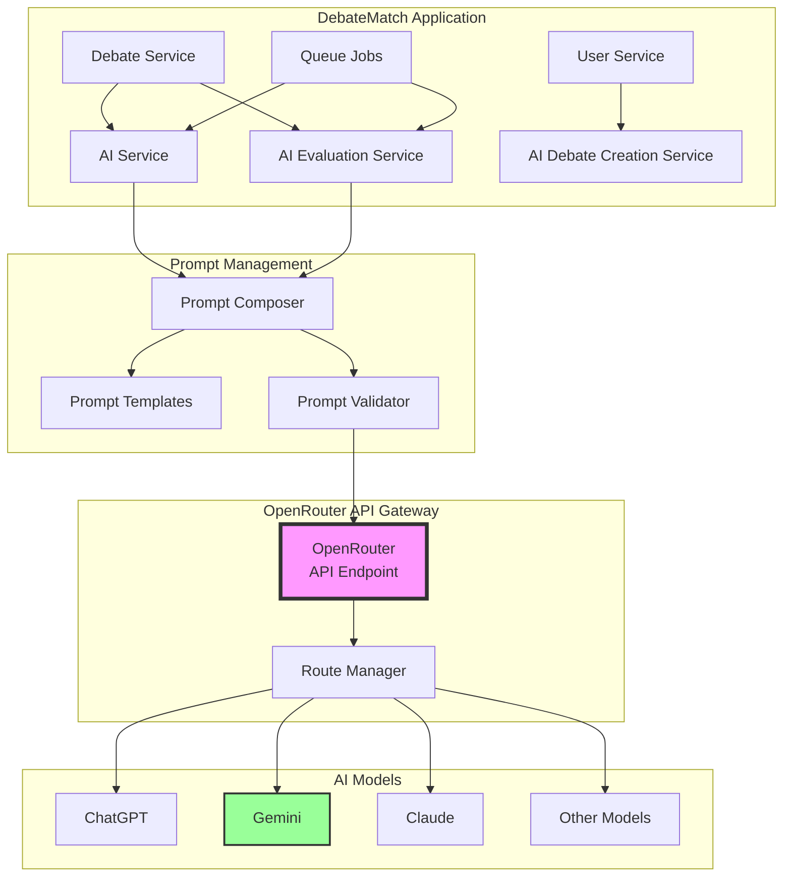
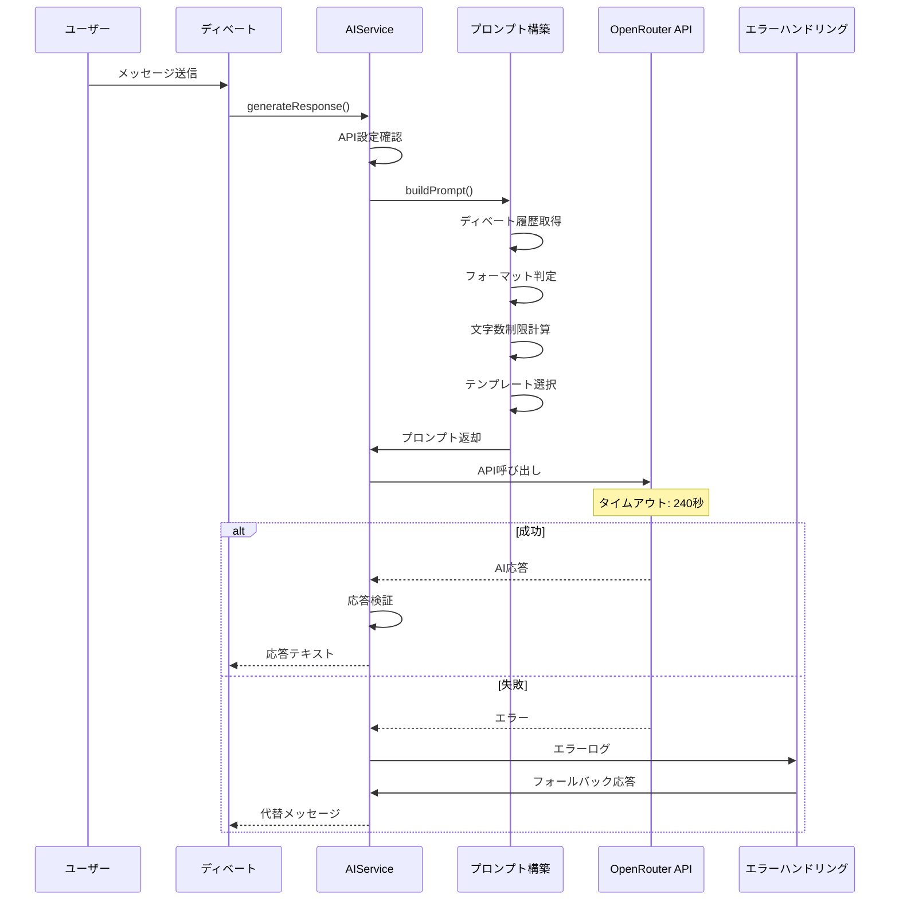
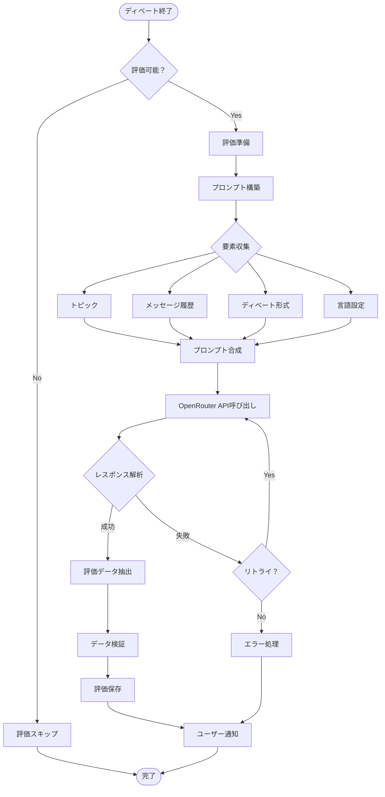
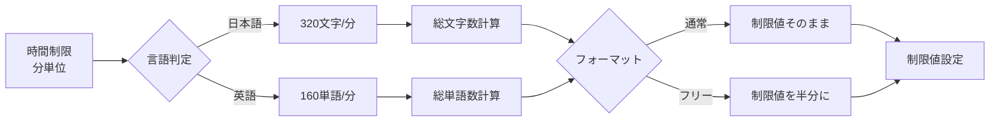
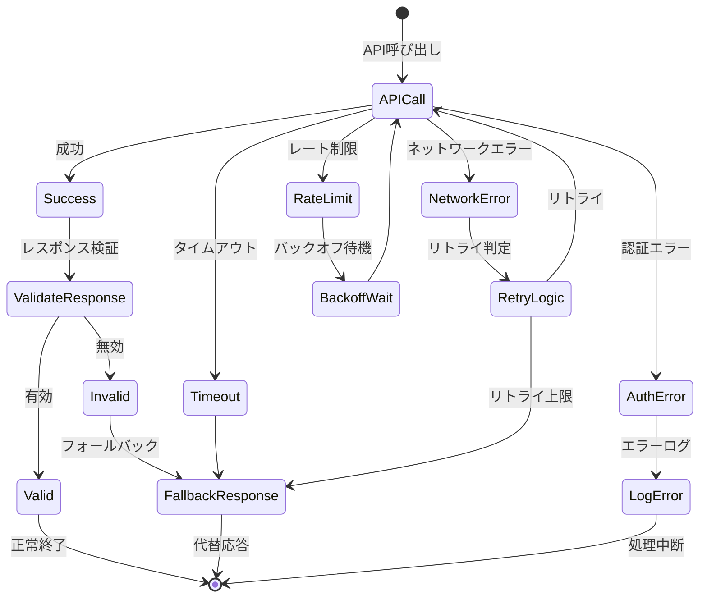
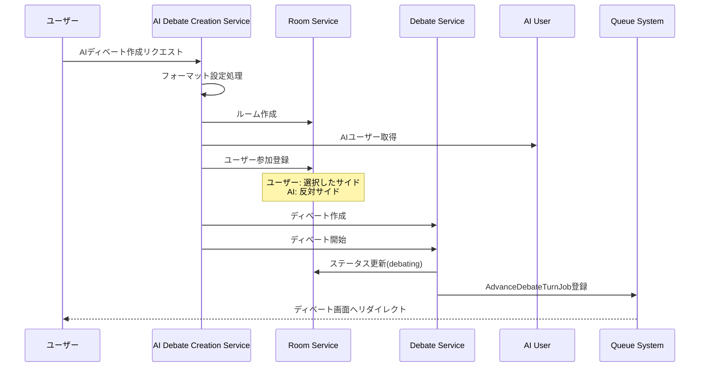

# AIインテグレーションアーキテクチャ

## 概要

DebateMatchでは、OpenRouter APIを通じて複数のAIモデルと統合し、AIディベート機能とディベート評価機能を提供しています。本ドキュメントでは、AI機能の統合アーキテクチャ、処理フロー、およびプロンプトエンジニアリングの戦略を解説します。

## AI統合全体構成

## 主要コンポーネント

### 1. AIService - AI応答生成サービス

### 2. AIEvaluationService - ディベート評価サービス

### 文字数/単語数制限の計算

## エラーハンドリングとフォールバック

### エラー階層

## AIディベート作成フロー

