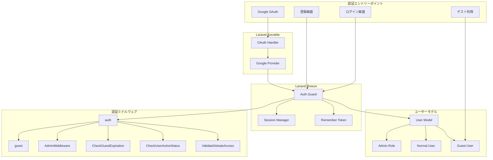
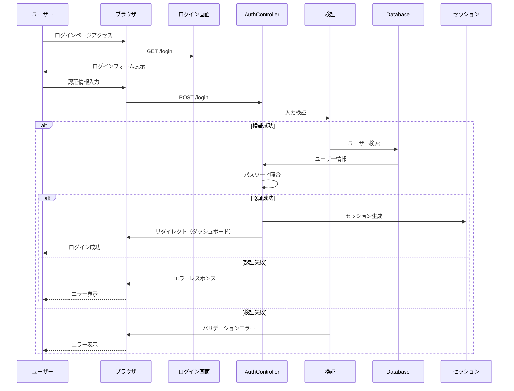
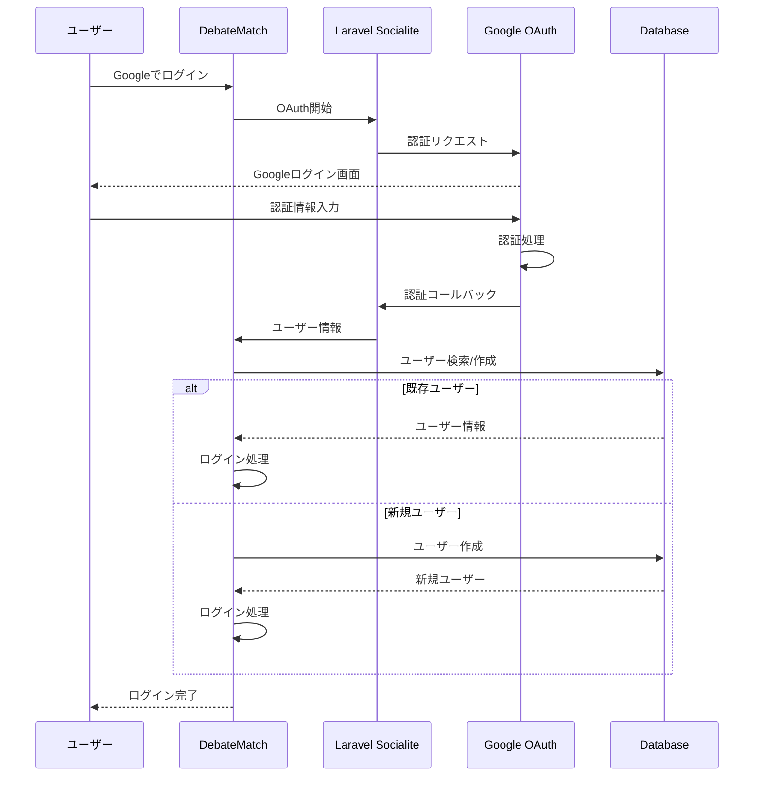
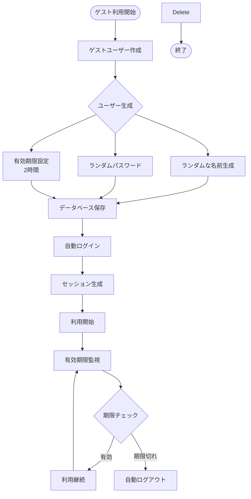
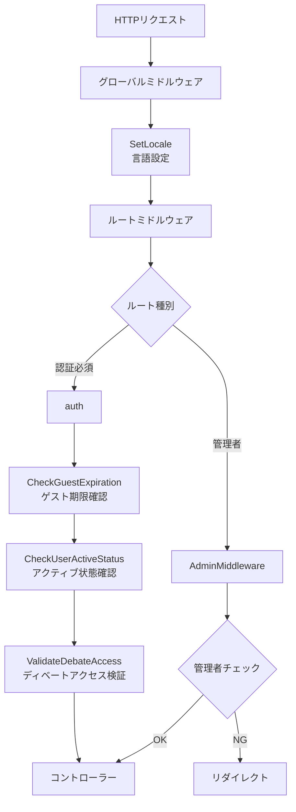
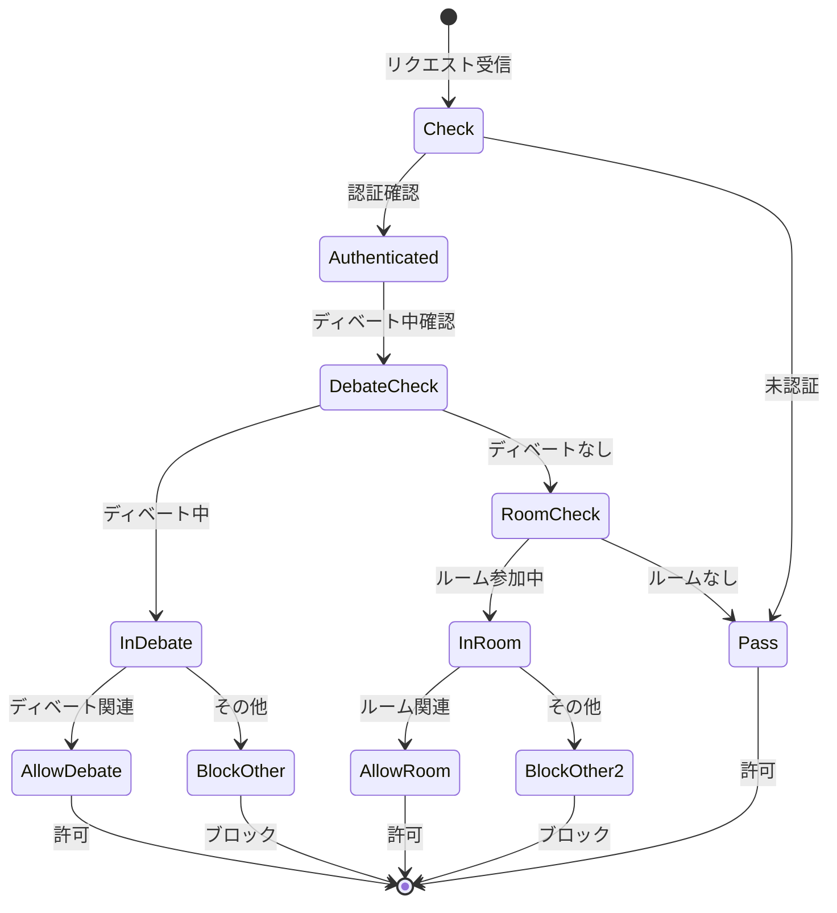
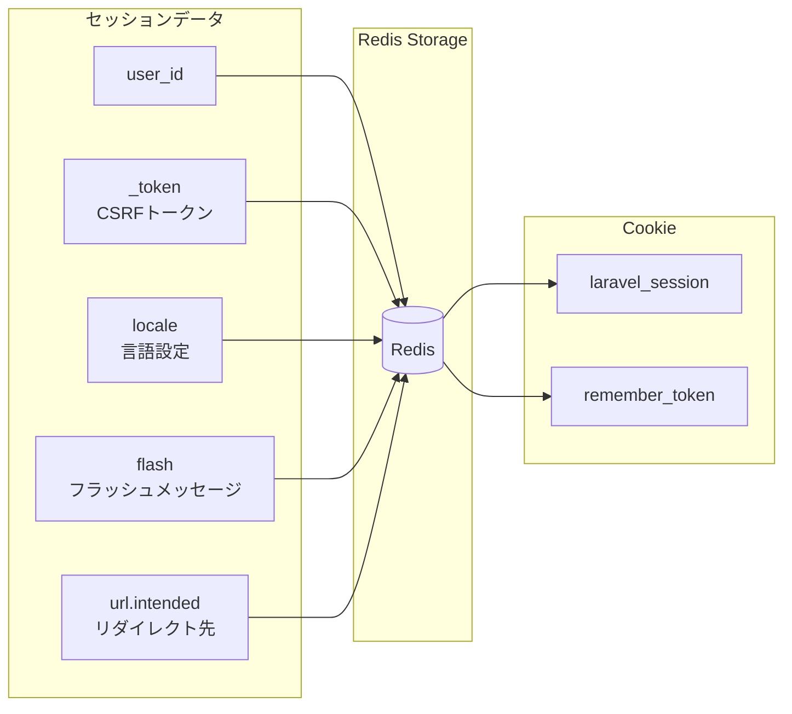

# 認証・認可設計図

## 概要

DebateMatchは、Laravel BreezeとLaravel Socialiteを基盤とした認証システムを実装しています。通常のEmail/Password認証に加え、Googleアカウントによるソーシャル認証、ゲストユーザー機能を提供し、きめ細かい権限管理を実現しています。

## 認証システム全体構成



## 認証フロー

### 1. Email/Password認証フロー



### 2. Google OAuth認証フロー



### 3. ゲストユーザー認証フロー



## 権限管理システム

### ミドルウェア階層



### 権限レベル定義

| 権限レベル   | 説明             | 可能な操作                                 |
| ------------ | ---------------- | ------------------------------------------ |
| ゲスト       | 一時的なユーザー | 全機能利用可能、（2時間限定）　　　　　　　　　　 |
| 通常ユーザー | 登録済みユーザー | 全機能利用可能、履歴保存                   　　　|
| 管理者       | is_admin = true  | 全機能 + 管理画面アクセス                  　|

### ミドルウェア詳細

#### 1. CheckGuestExpiration

```php
// ゲストユーザーの有効期限をチェック
if ($user->isGuest() && $user->isExpired()) {
    Auth::logout();
    return redirect()->route('welcome')
        ->with('info', 'ゲストアカウントの有効期限が切れました');
}
```

#### 2. CheckUserActiveStatus



#### 3. ValidateDebateAccess

- ディベートへのアクセス権限を検証
- 参加者でないユーザーのアクセスをブロック
- ディベートの状態に応じた適切なリダイレクト

#### 4. AdminMiddleware

```php
public function handle($request, $next)
{
    $user = $request->user();

    // 管理者権限チェック
    if (!$user || !$user->isAdmin() || $user->isGuest()) {
        return redirect()->route('welcome');
    }

    return $next($request);
}
```

## セッション管理

### セッション構成


