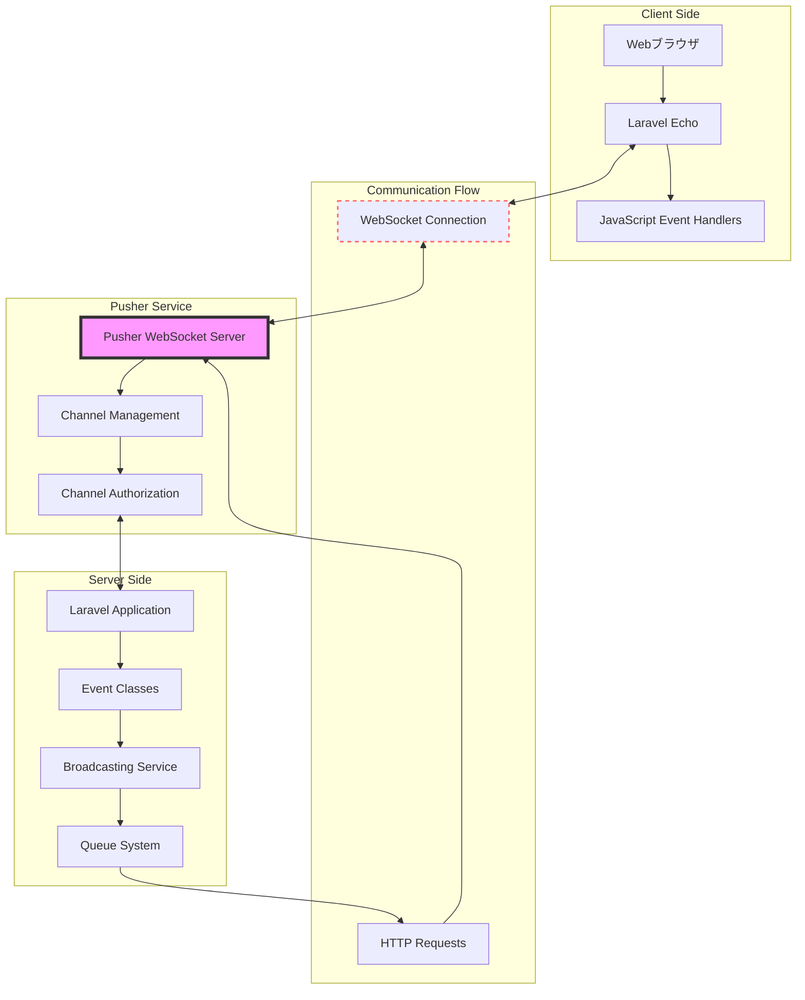
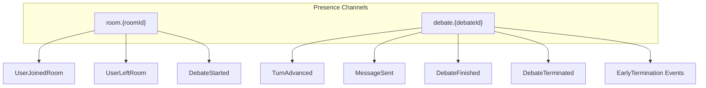
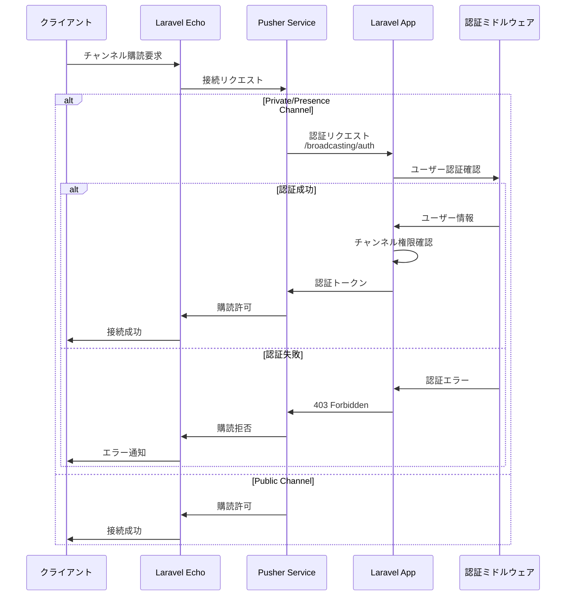

# リアルタイム通信設計

## 概要

DebateMatchは、Pusher WebSocketsサービスとLaravel Echoを組み合わせたリアルタイム通信システムを実装しています。ディベートの進行状況、メッセージの送受信、ユーザーの接続状態など、すべてのリアルタイムイベントがWebSocketを通じて配信されます。

## リアルタイム通信アーキテクチャ

## チャンネル設計

### チャンネル構造

### チャンネル認証フロー

## イベントブロードキャスト設計

### イベントカテゴリと配信チャンネル
| イベントカテゴリ | イベント名                | チャンネル                | 説明           |
| ---------------- | ------------------------- | ------------------------- | -------------- |
| ルーム管理       | UserJoinedRoom            | room.{roomId}            | ユーザー参加   |
|                  | UserLeftRoom              | room.{roomId}            | ユーザー退出   |
|                  | CreatorLeftRoom           | room.{roomId}            | 作成者退出     |
| ディベート進行   | DebateStarted             | room.{roomId}            | ディベート開始 |
|                  | TurnAdvanced              | debate.{debateId}        | ターン進行     |
|                  | MessageSent               | debate.{debateId}        | メッセージ送信 |
|                  | DebateFinished            | debate.{debateId}        | ディベート終了 |
|                  | DebateTerminated          | debate.{debateId}        | 強制終了       |
| 早期終了         | EarlyTerminationRequested  | debate.{debateId}        | 早期終了提案   |
|                  | EarlyTerminationAgreed     | debate.{debateId}        | 早期終了合意   |
|                  | EarlyTerminationRejected   | debate.{debateId}        | 早期終了拒否   |
|                  | EarlyTerminationExpired    | debate.{debateId}        | 提案期限切れ   |
| 評価             | DebateEvaluated           | debate.{debateId}        | AI評価完了     |
