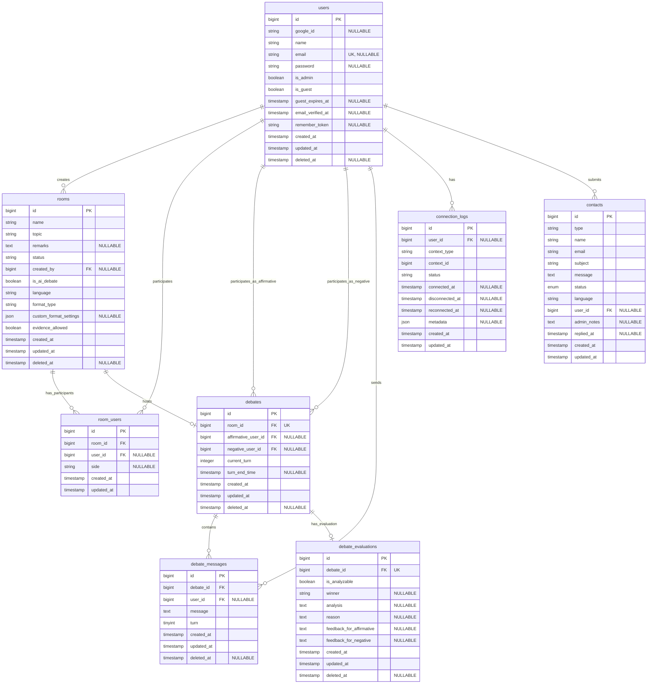
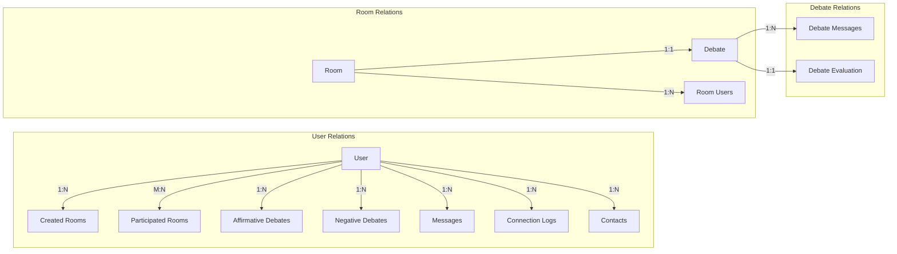

# データベース設計詳細

## 概要

DebateMatchのデータベースは、MySQLを使用し、Laravel Eloquent ORMを通じてアクセスされます。本ドキュメントでは、データベースの論理設計、物理設計、インデックス戦略、およびパフォーマンス最適化について詳述します。

## ER図（Entity Relationship Diagram）



## テーブル定義詳細

### 1. `users` テーブル

| カラム名            | データ型        | 制約               | 説明                   |
| ------------------- | --------------- | ------------------ | ---------------------- |
| `id`                | BIGINT UNSIGNED | PK, AUTO_INCREMENT | ユーザーID             |
| `google_id`         | VARCHAR(255)    | NULLABLE           | Google認証ID           |
| `name`              | VARCHAR(255)    | NOT NULL           | ユーザー名             |
| `email`             | VARCHAR(255)    | UNIQUE, NULLABLE   | メールアドレス         |
| `email_verified_at` | TIMESTAMP       | NULLABLE           | メール確認日時         |
| `password`          | VARCHAR(255)    | NULLABLE           | パスワード（ハッシュ） |
| `is_admin`          | BOOLEAN         | DEFAULT FALSE      | 管理者フラグ           |
| `is_guest`          | BOOLEAN         | DEFAULT FALSE      | ゲストユーザーフラグ   |
| `guest_expires_at`  | TIMESTAMP       | NULLABLE           | ゲストユーザー有効期限 |
| `remember_token`    | VARCHAR(100)    | NULLABLE           | Remember Meトークン    |
| `created_at`        | TIMESTAMP       | NOT NULL           | 作成日時               |
| `updated_at`        | TIMESTAMP       | NOT NULL           | 更新日時               |
| `deleted_at`        | TIMESTAMP       | NULLABLE           | 論理削除日時           |

### 2. `rooms` テーブル

| カラム名                 | データ型        | 制約               | 説明               |
| ------------------------ | --------------- | ------------------ | ------------------ |
| `id`                     | BIGINT UNSIGNED | PK, AUTO_INCREMENT | ルームID           |
| `name`                   | VARCHAR(255)    | NOT NULL           | ルーム名           |
| `topic`                  | VARCHAR(255)    | NOT NULL           | ディベートトピック |
| `remarks`                | TEXT            | NULLABLE           | 備考               |
| `status`                 | VARCHAR(255)    | DEFAULT 'waiting'  | ルーム状態         |
| `created_by`             | BIGINT UNSIGNED | NULLABLE, FK       | 作成者ID           |
| `is_ai_debate`           | BOOLEAN         | DEFAULT FALSE      | AIディベートフラグ |
| `language`               | VARCHAR(255)    | DEFAULT 'japanese' | 使用言語           |
| `format_type`            | VARCHAR(255)    | NOT NULL           | ディベート形式     |
| `custom_format_settings` | JSON            | NULLABLE           | カスタム設定       |
| `evidence_allowed`       | BOOLEAN         | DEFAULT FALSE      | 証拠使用可否       |
| `created_at`             | TIMESTAMP       | NOT NULL           | 作成日時           |
| `updated_at`             | TIMESTAMP       | NOT NULL           | 更新日時           |
| `deleted_at`             | TIMESTAMP       | NULLABLE           | 論理削除日時       |

### 3. `room_users` テーブル

| カラム名     | データ型        | 制約               | 説明       |
| ------------ | --------------- | ------------------ | ---------- |
| `id`         | BIGINT UNSIGNED | PK, AUTO_INCREMENT | ID         |
| `room_id`    | BIGINT UNSIGNED | NOT NULL, FK       | ルームID   |
| `user_id`    | BIGINT UNSIGNED | NULLABLE, FK       | ユーザーID |
| `side`       | VARCHAR(255)    | NULLABLE           | 参加サイド |
| `created_at` | TIMESTAMP       | NOT NULL           | 作成日時   |
| `updated_at` | TIMESTAMP       | NOT NULL           | 更新日時   |

### 4. `debates` テーブル

| カラム名              | データ型        | 制約                 | 説明               |
| --------------------- | --------------- | -------------------- | ------------------ |
| `id`                  | BIGINT UNSIGNED | PK, AUTO_INCREMENT   | ディベートID       |
| `room_id`             | BIGINT UNSIGNED | NOT NULL, FK, UNIQUE | ルームID           |
| `affirmative_user_id` | BIGINT UNSIGNED | NULLABLE, FK         | 肯定側ユーザーID   |
| `negative_user_id`    | BIGINT UNSIGNED | NULLABLE, FK         | 否定側ユーザーID   |
| `current_turn`        | INTEGER         | DEFAULT 0            | 現在のターン番号   |
| `turn_end_time`       | TIMESTAMP       | NULLABLE             | ターン終了予定時刻 |
| `created_at`          | TIMESTAMP       | NOT NULL             | 作成日時           |
| `updated_at`          | TIMESTAMP       | NOT NULL             | 更新日時           |
| `deleted_at`          | TIMESTAMP       | NULLABLE             | 論理削除日時       |

### 5. `debate_messages` テーブル

| カラム名     | データ型         | 制約               | 説明         |
| ------------ | ---------------- | ------------------ | ------------ |
| `id`         | BIGINT UNSIGNED  | PK, AUTO_INCREMENT | ID           |
| `debate_id`  | BIGINT UNSIGNED  | NOT NULL, FK       | ディベートID |
| `user_id`    | BIGINT UNSIGNED  | NULLABLE, FK       | ユーザーID   |
| `message`    | TEXT             | NOT NULL           | メッセージ   |
| `turn`       | TINYINT UNSIGNED | NOT NULL           | ターン番号   |
| `created_at` | TIMESTAMP        | NOT NULL           | 作成日時     |
| `updated_at` | TIMESTAMP        | NOT NULL           | 更新日時     |
| `deleted_at` | TIMESTAMP        | NULLABLE           | 論理削除日時 |

### 6. `debate_evaluations` テーブル

| カラム名                   | データ型        | 制約                 | 説明                     |
| -------------------------- | --------------- | -------------------- | ------------------------ |
| `id`                       | BIGINT UNSIGNED | PK, AUTO_INCREMENT   | ID                       |
| `debate_id`                | BIGINT UNSIGNED | NOT NULL, FK, UNIQUE | ディベートID             |
| `is_analyzable`            | BOOLEAN         | DEFAULT TRUE         | AI分析可否               |
| `winner`                   | VARCHAR(255)    | NULLABLE             | 勝者                     |
| `analysis`                 | TEXT            | NULLABLE             | 分析結果                 |
| `reason`                   | TEXT            | NULLABLE             | 勝敗理由                 |
| `feedback_for_affirmative` | TEXT            | NULLABLE             | 肯定側へのフィードバック |
| `feedback_for_negative`    | TEXT            | NULLABLE             | 否定側へのフィードバック |
| `created_at`               | TIMESTAMP       | NOT NULL             | 作成日時                 |
| `updated_at`               | TIMESTAMP       | NOT NULL             | 更新日時                 |
| `deleted_at`               | TIMESTAMP       | NULLABLE             | 論理削除日時             |

### 7. `connection_logs` テーブル

| カラム名          | データ型        | 制約               | 説明             |
| ----------------- | --------------- | ------------------ | ---------------- |
| `id`              | BIGINT UNSIGNED | PK, AUTO_INCREMENT | ID               |
| `user_id`         | BIGINT UNSIGNED | NULLABLE, FK       | ユーザーID       |
| `context_type`    | VARCHAR(255)    | NOT NULL           | コンテキスト種別 |
| `context_id`      | BIGINT UNSIGNED | NOT NULL           | コンテキストID   |
| `status`          | VARCHAR(255)    | NOT NULL           | 接続状態         |
| `connected_at`    | TIMESTAMP       | NULLABLE           | 接続日時         |
| `disconnected_at` | TIMESTAMP       | NULLABLE           | 切断日時         |
| `reconnected_at`  | TIMESTAMP       | NULLABLE           | 再接続日時       |
| `metadata`        | JSON            | NULLABLE           | メタデータ       |
| `created_at`      | TIMESTAMP       | NOT NULL           | 作成日時         |
| `updated_at`      | TIMESTAMP       | NOT NULL           | 更新日時         |

### 8. `contacts` テーブル

| カラム名      | データ型        | 制約                                                  | 説明           |
| ------------- | --------------- | ----------------------------------------------------- | -------------- |
| `id`          | BIGINT UNSIGNED | PK, AUTO_INCREMENT                                    | ID             |
| `type`        | VARCHAR(50)     | NOT NULL                                              | 問い合わせ種別 |
| `name`        | VARCHAR(255)    | NOT NULL                                              | 名前           |
| `email`       | VARCHAR(255)    | NOT NULL                                              | メールアドレス |
| `subject`     | VARCHAR(500)    | NOT NULL                                              | 件名           |
| `message`     | TEXT            | NOT NULL                                              | 内容           |
| `status`      | ENUM            | 'new', 'in_progress', 'replied', 'resolved', 'closed' | ステータス     |
| `language`    | VARCHAR(2)      | DEFAULT 'ja'                                          | 言語           |
| `user_id`     | BIGINT UNSIGNED | NULLABLE, FK                                          | ユーザーID     |
| `admin_notes` | TEXT            | NULLABLE                                              | 管理者メモ     |
| `replied_at`  | TIMESTAMP       | NULLABLE                                              | 返信日時       |
| `created_at`  | TIMESTAMP       | NOT NULL                                              | 作成日時       |
| `updated_at`  | TIMESTAMP       | NOT NULL                                              | 更新日時       |

## インデックス戦略

### 主要インデックス

```sql
-- users テーブル
CREATE UNIQUE INDEX users_email_unique ON users(email);
CREATE INDEX users_is_guest_guest_expires_at_index ON users(is_guest, guest_expires_at);

-- rooms テーブル
CREATE INDEX rooms_created_by_foreign ON rooms(created_by);
CREATE INDEX rooms_status_index ON rooms(status);

-- room_users テーブル
CREATE INDEX room_users_room_id_foreign ON room_users(room_id);
CREATE INDEX room_users_user_id_foreign ON room_users(user_id);

-- debates テーブル
CREATE UNIQUE INDEX debates_room_id_unique ON debates(room_id);
CREATE INDEX debates_affirmative_user_id_foreign ON debates(affirmative_user_id);
CREATE INDEX debates_negative_user_id_foreign ON debates(negative_user_id);

-- debate_messages テーブル
CREATE INDEX debate_messages_debate_id_index ON debate_messages(debate_id);
CREATE INDEX debate_messages_debate_id_created_at_index ON debate_messages(debate_id, created_at);
CREATE INDEX debate_messages_user_id_foreign ON debate_messages(user_id);

-- debate_evaluations テーブル
CREATE UNIQUE INDEX debate_evaluations_debate_id_unique ON debate_evaluations(debate_id);

-- connection_logs テーブル
CREATE INDEX connection_logs_user_id_created_at_index ON connection_logs(user_id, created_at);
CREATE INDEX connection_logs_user_id_context_type_context_id_index ON connection_logs(user_id, context_type, context_id);
CREATE INDEX connection_logs_context_type_context_id_status_index ON connection_logs(context_type, context_id, status);
CREATE INDEX idx_latest_log_lookup ON connection_logs(user_id, context_type, context_id, created_at);
CREATE INDEX idx_status_stats ON connection_logs(status, context_type, created_at);

-- contacts テーブル
CREATE INDEX contacts_status_created_at_index ON contacts(status, created_at);
CREATE INDEX contacts_type_created_at_index ON contacts(type, created_at);
CREATE INDEX contacts_email_index ON contacts(email);
```

## リレーションシップ設計

### リレーションシップ図



## データ整合性とトリガー

### 外部キー制約

```sql
-- rooms テーブル
ALTER TABLE rooms
ADD CONSTRAINT fk_rooms_created_by
FOREIGN KEY (created_by) REFERENCES users(id) ON DELETE SET NULL;

-- room_users テーブル
ALTER TABLE room_users
ADD CONSTRAINT fk_room_users_room
FOREIGN KEY (room_id) REFERENCES rooms(id) ON DELETE CASCADE,
ADD CONSTRAINT fk_room_users_user
FOREIGN KEY (user_id) REFERENCES users(id) ON DELETE SET NULL;

-- debates テーブル
ALTER TABLE debates
ADD CONSTRAINT fk_debates_room
FOREIGN KEY (room_id) REFERENCES rooms(id) ON DELETE CASCADE,
ADD CONSTRAINT fk_debates_affirmative
FOREIGN KEY (affirmative_user_id) REFERENCES users(id) ON DELETE SET NULL,
ADD CONSTRAINT fk_debates_negative
FOREIGN KEY (negative_user_id) REFERENCES users(id) ON DELETE SET NULL;

-- debate_messages テーブル
ALTER TABLE debate_messages
ADD CONSTRAINT fk_messages_debate
FOREIGN KEY (debate_id) REFERENCES debates(id) ON DELETE CASCADE,
ADD CONSTRAINT fk_messages_user
FOREIGN KEY (user_id) REFERENCES users(id) ON DELETE SET NULL;

-- debate_evaluations テーブル
ALTER TABLE debate_evaluations
ADD CONSTRAINT fk_evaluations_debate
FOREIGN KEY (debate_id) REFERENCES debates(id) ON DELETE CASCADE;

-- connection_logs テーブル
ALTER TABLE connection_logs
ADD CONSTRAINT fk_logs_user
FOREIGN KEY (user_id) REFERENCES users(id) ON DELETE SET NULL;

-- contacts テーブル
ALTER TABLE contacts
ADD CONSTRAINT fk_contacts_user
FOREIGN KEY (user_id) REFERENCES users(id) ON DELETE SET NULL;
```

### データ整合性ルール

1. **ルーム削除時の処理**

    - ルーム削除時は関連するディベートも削除（CASCADE）
    - ディベート中のルームは削除不可（アプリケーション層で制御）

2. **ユーザー削除時の処理**

    - ユーザー削除は論理削除（soft delete）
    - 関連するディベート記録は保持（SET NULL）

3. **一意性制約**
    - 1つのルームに1つのディベートのみ
    - メールアドレスの一意性

## パフォーマンス最適化

### 1. クエリ最適化

```php
// N+1問題の回避（Eager Loading）
$debates = Debate::with([
    'room',
    'affirmativeUser',
    'negativeUser',
    'messages.user',
    'evaluations'
])->get();

// 効率的なページネーション
$rooms = Room::where('status', 'waiting')
    ->orderBy('created_at', 'desc')
    ->paginate(20);
```

### 2. データベース設計の最適化

- **正規化レベル**: 第3正規形を基本とし、パフォーマンスのため一部非正規化
- **JSONカラムの使用**: 柔軟な設定保存のため`custom_format_settings`にJSON型を採用
- **ENUM型の使用**: ステータスなど固定値にはENUM型を使用してストレージ効率化
