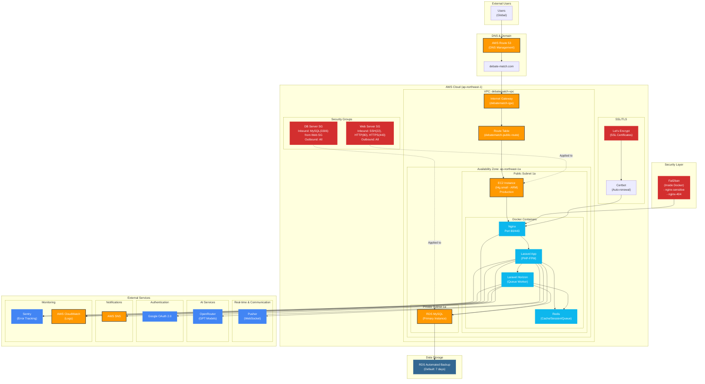

# インフラ構成図

## 1. 概要

このドキュメントは、DebateMatchアプリケーションの本番環境におけるインフラストラクチャ全体の構成を視覚的に示したものです。AWSクラウドを中心に、各種マネージドサービス、外部サービス、およびセキュリティ対策がどのように連携しているかを明らかにします。

## 2. 構成図

## 3. 主要コンポーネント解説

### 3.1. AWS Cloud (ap-northeast-1)

- **EC2 Instance (t4g.small)**: アプリケーションのメインサーバー。Nginx、Laravel App、Horizon（キューワーカ）、RedisがDockerコンテナとして稼働します。
- **RDS MySQL**: プライマリデータベース。可用性と運用負荷軽減のため、マネージドサービスであるRDSを利用します。データはプライベートサブネットに配置し、Webサーバーからのアクセスのみを許可しています。
- **Route 53**: ドメイン名（debate-match.com）の名前解決を行うDNSサービスです。
- **VPC (debatematch-vpc)**: 論理的に分離されたプライベートネットワーク空間。パブリックサブネットとプライベートサブネットに分割し、セキュリティを確保しています。
- **Security Groups**: インスタンスレベルのファイアウォール。Webサーバー用とDBサーバー用に分離し、最小権限の原則に基づいたアクセス制御を行います。
- **Let's Encrypt & Certbot**: 無料のSSL/TLS証明書と、その自動更新ツール。Nginxと連携し、常時HTTPS通信を保証します。

### 3.2. Dockerコンテナ

- **Nginx**: リバースプロキシとして機能し、ユーザーからのHTTP/HTTPSリクエストを受け付け、Laravelアプリケーション（PHP-FPM）に転送します。
- **Laravel App**: アプリケーション本体です。
- **Laravel Horizon**: Redisキューを監視・処理するバックグラウンドワーカです。AIによる評価など、時間のかかる処理を非同期で実行します。
- **Redis**: 高速なインメモリデータストア。セッション管理、キャッシュ、キューイングに利用します。

### 3.3. 外部サービス

- **Pusher**: WebSocketを利用したリアルタイム通信サービス。ディベート中のメッセージ交換などに使用します。
- **OpenRouter**: 複数の大規模言語モデル（LLM）を統一的なインターフェースで利用できるAPIゲートウェイ。AI評価機能で使用します。
- **Google OAuth**: ソーシャルログイン機能を提供します。
- **AWS SNS**: 信頼性の高い通知サービス。主にバッチ処理の結果通知などに利用します。
- **Sentry**: リアルタイムのエラー追跡・監視サービス。アプリケーションの例外を検知し、開発者に通知します。
- **AWS CloudWatch**: AWSリソースとアプリケーションのログを収集・監視します。

### 3.4. セキュリティ

- **Fail2ban**: ログファイルを監視し、不正なアクセス試行（ブルートフォース攻撃など）を検知したIPアドレスをブロックします。

## 4. ネットワークフロー

1.  ユーザーは `debate-match.com` にアクセスします。
2.  Route 53がドメイン名を解決し、EC2インスタンスのElastic IPアドレスを返します。
3.  リクエストはインターネットゲートウェイを経由し、パブリックサブネットのEC2インスタンスに到達します。
4.  EC2インスタンスのNginxコンテナがリクエストを受け、Laravelアプリケーションに転送します。
5.  アプリケーションは必要に応じて、プライベートサブネットのRDSや外部サービス（Pusher, OpenRouter等）と通信します。
6.  レスポンスは逆の経路を辿ってユーザーに返されます。

## 5. 設計上の考慮事項

- **セキュリティ**: DBをプライベートサブネットに配置し、セキュリティグループで厳格なアクセス制御を行うことで、データ保護を強化しています。
- **運用負荷の軽減**: RDSやPusherなどのマネージドサービスを積極的に利用し、インフラ管理のオーバーヘッドを削減しています。
- **スケーラビリティ**: 現状はシングルインスタンス構成ですが、将来的なアクセス増に対応するため、ロードバランサーとEC2オートスケーリンググループを導入できるよう設計されています。RDSもリードレプリカの追加やインスタンスタイプの変更が容易です。
